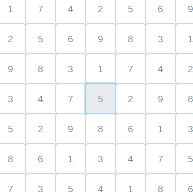

SUDOKU: Angular-Node-Mocha-Karma-Nginx-Docker

TABLE OF CONTENTS\
	<pre> INTRODUCTION	</pre>
	<pre> SPECIFICATIONS	</pre>
	<pre> SOFTWARES REQUIRED	</pre>
	<pre> SOURCE CODE	</pre>
	<pre> INSTALLATION NOTES	</pre>
	<pre> ABOUT THE APPLICATION	</pre>

INTRODUCTION\
	This Sudoku web application is built using Angular for frontend User Interface and Express, Node for handling the API calls. We use Karma for testing the frontend component and Mocha for testing our API calls. We also make use of Nginx for Reverse Proxy and Docker for deploying images for containers. 
	  

<b>Check out this video to see the demo Docker Build of Web-service of our Sudoku Application.</b>

<pre><i>If the above video doesn't seem to work, you can find the same clip of Demo at (~/readme_figs/DemoVideos/dockerBuildDemo.mp4) location.</i></pre>
 

SPECIFICATIONS\
	<pre>A web service that returns a randomized 9x9 grid of integers in the range [1-9] representing a Sudoku board:</pre>
		<ul>
		<li> Calls should be accessible via ‘/sudoku/board’ for loading the Sudoku board in the default mode. i.e. no cell in the board is selected. This may or may not take the size of the board as its parameter in the request header</li>
		<li> Calls should also be accessible via ‘/sudoku/boardCell’ for loading the Sudoku board in case a cell in the board is selected. This call takes the selected cell information as its header </li>
		<li> The resulting array of values must be valid abiding all the rules of the Sudoku game</li>
		<li> Content type of the request/response is supposed to be application/json</li>
		<li> Request must return the array of numbers generated for the Sudoku board in its response body</li>
		<li> The entire reception of request to sending of the response must take less than 500ms</li>
		<li> Programming language : Typescript, Express, Node</li>
		<li> Build tools: npm</li>
		<li> Testing tools: Karma/Mocha</li>
		</ul>
	<pre>A Single Page Application which loads and displays a Sudoku board with the values sent by the API server:</pre>
	<ul>
	<li> When the web page loads initially, a spinner should be displayed until the board values are fetched from the server</li>
	<li> Upon reception of the values, the spinner disappears and the board is displayed</li>
	<li> RELOAD button which when clicked refreshes the board values by fetching the fresh values from the server</li>
	<li> RELOAD button is deactivated until the spinner exists</li>
	<li> If a cell is selected on the board and the Reload button is clicked then fresh board is generated with new values without altering the value and the position of the selected cell</li>
	<li> Cell selection must act like a toggle (On/Off) when clicked</li>
	<li> The resulting Sudoku board must be valid abiding all the rules of the Sudoku game</li>
	<li> Programming language: Typescript, Angular</li>
	<li> Build tools: npm</li>
	<li> Libraries & tools: HTML5, CSS, Angular, Karma and Bootstrap</li>
	</ul>
	<pre>Nginx is used to act as a reverse proxy to communicate with the server API calls so that the SPA (Single Page Application) and the web service appear as one website on the local machine:</pre>
 
	<pre>Dockerize the web-service, frontend components and the entire application:</pre>
			<ul>
				<li> Web service docker container must be run via the command   <b>docker run –it –p 8080:8080 sudoku-ws:level-4</b></li>
				<li> When the web service is running, <b>curl http://loaclhost:8080/sudoku/board</b> should return the Sudoku array of values</li>
				<li> Single Page Application docker container must be built with one command generating a docker image called <b>sudoku-spa</b> with <b>level-4</b> as its tag.</li>
				<li> Nginx should be used to act as a reverse proxy to talk between the SPA and web service</li>
				<li> Technology: Docker </li>
			</ul>

SOFTWARES REQUIRED\
	The software that are needed for the application to be edited or executed
	<ul>
	<li> OPERATING SYSTEM UTILIZED: UBUNTU-18.04 </li>
	<li> ‘backend’ --> Node JS.</li>
	<li> ‘API calls’ --> Express (not needed to install explicitly- gets auto installed while installing frontend) </li>
	<li> ‘frontend’ --> Angular (4/6), Bootstrap.</li>
	<li> ‘testing’ --> Karma, Mocha, Jasmine</li>
	<li> ‘reverse proxy’ --> Nginx.</li>
	<li> ‘docker images’ --> Docker.</li>
	</ul>

SOURCE CODE\
	The Source code for the application is in the ‘sudokuApp’ folder
	<ul>
	<li> ‘sudokuServer’ --> This folder has the source code for the API which generate the values for Sudoku Board.</li>
	<li>‘sudokuBoard’ --> This folder has the source code for the Front User Interface which displays the values received from the API.</li>
	<li> ‘dockerfile’ --> Each folder have the Dockerfiles needed for building our docker image <b>(Please fetch ‘master-docker’ git Repo)</b>.</li>
	<li>‘docker-compose.yml’ -->  For running our SPA and web service as a single container image <b>(Please fetch ‘master-docker’ git Repo)</b>.</li>
	</ul>

INSTALLATION NOTES\
	All the execution of this application will be done via command prompt terminal. You can skip the Installation step if you have already Nginx installed. But you are still required to follow the <i>Italicized</i> steps in-order to setup the project properly and be able to run it locally
<ol type="A">
	<li> Installing Nginx in Ubuntu </li>
	<ul>
		<li> Go to Sudo nano /etc/apt/sources.list</li>
		<li> Add the following lines:   <b>deb http://nginx.org/packages/mainline/ubuntu/ bionic nginx</b></li>
		<li> Import the Repo Keys:   <b>sudo wget http://nginx.org/keys/nginx_signing.key sudo apt-key add nginx_signing.key</b></li>
		<li> Install Nginx   <b>sudo apt update sudo apt install nginx</b></li>
		<li> Enable and Run Nginx   <b>sudo systemctl start nginx sudo systemctl enable nginx</b></li>
		<li> Enable firewall   <b>sudo ufw enable</b></li>
		<li> <i>Create a sudokuapp.conf file for the server in /etc/nginx/conf.d/ location <b>sudo nano /etc/nginx/conf.d/sudokuapp.conf</b></i></li>
		<li> <i>Copy the contents of ‘nginx_confD_sudokuapp.conf’ file into the sudokuapp.conf file created at /etc/nginx/conf.d/ location</i></li>
		<li> <i>Disable the default conf file <b>sudo mv /etc/nginx/conf.d/default.conf  etc/nginx/conf.d/default.conf.disabled</b></i></li>
		<li> <i>Test and Reload nginx <b>sudo nginx –t sudo nginx -s reload</b></i></li>
	</ul>
	<li> ‘Nginx Setup’ </li>
	<ul>
		<li> Check the applications that the firewall has given access to by default:  <b>sudo ufw app list </b></li>
		<li> Allow the ‘Nginx Full’(Both encrypted and unencrypted Traffics are allowed), ‘Nginx HTTP’(Unencrypted Traffics are allowed) or ‘Nginx HTTPS’(Only encrypted Traffics are allowed) as per your needs. <b>sudo ufx allow ‘Nginx Full’ sudo ufx allow ‘Nginx HTTPS’ sudo ufx allow ‘Nginx HTTPS’</b></li>
		<li> Or you can enable the specifically required Ports as per your needs. <b>sudo ufx allow 8080/tcp 
sudo ufx allow 80/tcp sudo ufx allow 21/ftp</b></li>
		<li> Check the status of the recently allowed traffic issue the following command. You should see a full list of all the traffic ports enabled <b>sudo ufw status </b></li>
		<li> Active status is displayed if Nginx is running with the help of following command. <b>sudo systemctl status nginx</b></li>
		<li> <i>Copy your Git Cloned Code into /var/www/ <b>sudo cp -r /home/YOUR_PC_NAME/YOUR_GIT_FOLDER/. /var/www/ </b></i></li>
		<li> <i>Then point your domain name to our new server. So create a record in hosting providers’ DNS setting by pointing the domain name (sudoku.com) to our server IP address(0.0.0.0). <b>sudo nano /etc/hosts</b></i></li>
		<li> <i>Add the domain name - IP address mapping <b>0.0.0.0		suduko.com </b></i></li>
		<li> <i>Navigate into the /var/www/sudokuapp/sudokuBoard and give permissions:</i> <b>sudo chmod -R 777 *</b></li>
		<li> <i>Move the Static files to the Server <b>scp -r * 0.0.0.0:/var/www/sudokuapp/sudukoBoard</b></i></li>
		<li> <i>To configure nginx server to point to our new location navigate to nginx folder Create ‘sites-available’ and ‘sites-enabled’ folder if not created by default: <b>cd /etc/nginx mkdir sites-available && mkdir sites-enabled</b></i></li>
		<li> <i>Create the configuration files to our files in ‘sites-available’ and ‘sites-enabled’ has the symbolic link which we will tell nginx to run. Open ‘sudokuapp’ and copy its contents into the file you open in terminal using the command below <b>sudo nano sites-available/sudokuapp</b></i></li>
		<li> <i>Link the ‘sudokuapp’ file to the ‘sites-enabled’ folder: <b>sudo ln -s /etc/nginx/sites-available/sudokuapp /etc/nginx/sites-enabled/sudokuapp </b></i></li>
		<li> <i>Remove the ‘default’ file from ‘sites-enabled’ folder if created by default <b>sudo mv /etc/nginx/sites-enabled/default /home/YOUR_DESIRED_LOCATION/default </b></i></li>
		<li> <i>Restart nginx: <b>sudo systemctl restart nginx</b></i></li>
	</ul>
<li> ‘Backend’ </li>
	<ul>
		<li> Navigate into your /var/www/sudokuapp/sudokuServer/ and install then run the Server <b>cd /var/www/sudokuapp/sudokuServer</b> <b>sudo npm install</b>  <b>nodemon </b>  Or  <b>node index.js</b> </li>
		<li> Test the sudokuServer: <b>npm test</b></li>
	</ul>
<li> ‘Frontend’ </li>
	<ul>
		<li> Navigate into your /var/www/sudokuapp/sudokuBoard/ and install then run the Sudoku Board UI <b>cd /var/www/sudokuapp/sudokuBoard</b> <b>sudo npm install</b>  <b>ng serve </b>  Or  <b>npm start</b> </li>
		<li> Test the sudokuBoard:  <b>ng test  Or   npm test</b></li>
	</ul>
<li> ‘Docker Images’ </li>
	<ul>
		<li> Clone the repo and checkout to ‘master-docker’ branch and navigate into ‘sudokuapp’ folder:  <b>git clone https://github.com/mattasridhar/sudokuapp.git git checkout master-docker</b> </li>
		<li> Have Docker installed up and running. Also from /etc/hosts file comment the Domina-IP mapping we did earlier. # 0.0.0.0		sudoku.com </b> </li>
		<li> Build the docker image for the server, navigate to the ‘sudokuServer’ folder and issue the following command to create a docker image. <b>docker build -t sudoku-ws:level-4 . </b> </li>
		<li> Run the docker image we just built for the server, issue the following command to run the docker image. This command maps the server to run on 8080. <b>docker run -p 8080:8080 -d sudoku-ws:level-4  Or  docker run -it -p 8080:8080 sudoku-ws:level-4</b> </li>
		<li> Navigate to localhost:8080 in browser or issue the curl command(requires ‘curl’ installed). <b>curl http://localhost:8080/sudoku/board</b> </li>
		<li> Build the docker image for front-end, navigate to the ‘sudokuBoard’ folder and issue the following command to create a docker image. <b>docker build -t sudoku-spa:level-4 . </b> </li>
		<li> Run the docker image we just built for the front-end, issue the following command to run the docker image. This command maps the front-end to run on 4200. <b>docker run -d -v ${PWD}:/app -v /app/node_modules -p 2305:4200 --name sudoku-spa --rm sudoku-spa:level-4</b> </li>
		<li> To stop running the docker image we just built for the front-end, issue the following command. <b>docker stop sudoku-spa </b> </li>
		<li> To stop running the docker image we just built for the server, get the container id from the output of the first command and then issue the second command specifying the retrieved container id. <b>docker ps docker stop CONTAINER_ID </b> </li>
		<li> Move a directory up (<b>cd ..</b>) i.e. inside the ‘sudokuapp’ folder and issue the following command to see the whole sudoku application be deployed using nginx. The website should be accessible on localhost:9093 and server on localhost:9094. <b>docker-compose up --build</b> </li>
	</ul>
	</ol>

ABOUT THE APPLICATION\
	This application can be accessed by visiting the url ‘http://sudoku.com/’ after you have installed and initiated the step given in the ‘INSTALLATION NOTES’ section(except the Docker section if you are running it locally).
The application loads and sends a query to the server via the ‘/sudoku/board’ service call and until it receives the data, a spinner is shown to the user. The reload button is also displayed until the data is populated. Figure 1 shows the screen before loading of the board and Figure 2 displays the screen when the data is received and Sudoku board is populated with values.

	Figure 1: While the UI is waiting for the server response

	Figure 2: Display of the screen after reception of the Board values from the server.

The user can toggle the cells in the UI. Upon selection of a cell any previously selected cell will be un-selected. The selected cell (darker shade) and un-selected cell is differentiated by a difference in their shade as shown in Figure 3.

	Figure 3: Selected and Un-selected cell.

If for some reason, the application never receives any message then the Figure 1 screen will be shown to the user. But if the server responds with an empty array due to network issues or malformed url formation then the error message of screen at Figure 4 is shown.

	Figure 4: Error Screen
